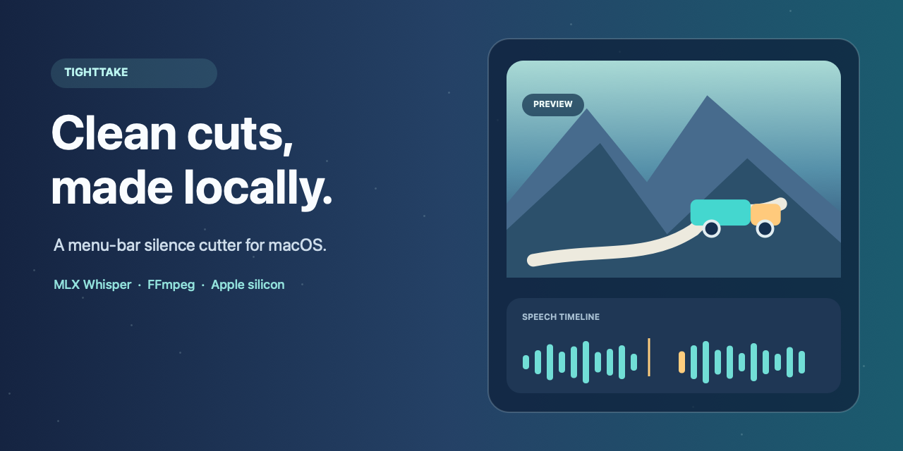

# TightTake



TightTake is the open-source project for a menu-bar macOS silence cutter. The included app currently appears in macOS as **Video Smart Cut**. It trims long pauses while keeping a little breathing room around speech and creates a new MP4 instead of modifying the input.

## Download

[**Download TightTake v1.3.5 for Apple silicon (ZIP)**](https://github.com/Rickveloper/TightTake/releases/latest/download/TightTake-macOS-arm64.zip)

Requires macOS 14 or later. The app appears in macOS as **Video Smart Cut**. This initial download is ad-hoc signed and not notarized, so macOS may show a security warning or block its first launch. The release notes include the build and signing details.

## Quick demo

1. Click the app's menu-bar icon, then choose a video or drag one into the popover.
2. Start the cut and follow transcription, silence analysis, and render progress.
3. Choose an output name and folder; TightTake creates a new MP4 and leaves the source video unchanged.

The app runs on Apple silicon Macs. It uses [MLX Whisper](https://github.com/ml-explore/mlx-examples/tree/main/whisper) for local word timestamps and FFmpeg for the final render.

## What it does

- Lives in the macOS menu bar; drag in a video or choose one from a file picker.
- Transcribes English speech locally, then keeps speech sections and configurable pauses.
- Leaves 0.20 seconds before and 0.30 seconds after each recognized word to avoid abrupt cuts.
- Renders a new MP4 with FFmpeg; Apple VideoToolbox hardware encoding is optional.
- Lets you choose an output folder and filename. Existing files are preserved; a numbered name is used instead.
- Shows transcription, analysis, and render progress.

Supported input extensions: `.mp4`, `.mov`, `.m4v`, and `.mkv`.

## Requirements

- Apple silicon Mac (arm64) running macOS 14 or later.
- Xcode Command Line Tools, including `swiftc`.
- Homebrew FFmpeg (`ffmpeg` and `ffprobe`).
- Python and `pipx` to install `mlx-whisper`.
- Internet access the first time MLX Whisper fetches the configured model. The model is not included in this repository.

Install the command-line dependencies:

```sh
brew install ffmpeg pipx
pipx install mlx-whisper
```

The app looks for `mlx_whisper` in `~/.local/bin`, `/opt/homebrew/bin`, and `/usr/local/bin`, and for FFmpeg tools in the common Homebrew and system locations. If your tools are installed elsewhere, make them available in one of those locations before launching the app.

## Build and run

```sh
git clone https://github.com/Rickveloper/tighttake.git
cd tighttake
./scripts/build-app.sh
open "build/Video Smart Cut.app"
```

The build script compiles the Swift source into a standard `.app` bundle and applies an ad-hoc signature for local development. It does not produce an Apple Developer ID signature or notarization. For the prebuilt Apple silicon download, use the link above.

To regenerate the original project artwork and app icon on a Mac, run `./scripts/package-assets.sh`.

## Privacy

Video Smart Cut has no in-app telemetry or network client. The app passes the selected video path to the locally installed `mlx_whisper`, `ffprobe`, and `ffmpeg` processes. Transcription and rendering are performed on the Mac, and the app does not upload the video or its transcript.

On first use, MLX Whisper may download model files from its configured model host and cache them on the Mac. That download is performed by the separately installed MLX Whisper tool, not by an upload feature in Video Smart Cut. Review the dependency and model terms before use. See [Privacy and Data Handling](docs/PRIVACY.md) for details.

## Open-source status

This project is distributed under the MIT License. Third-party tools and model files are separate dependencies and retain their own licenses and terms. See [Security](docs/SECURITY.md) to report a vulnerability and [Contributing](CONTRIBUTING.md) for project guidelines.

## Current validation

The v1.3.5 source builds and its app archive and embedded signature are checked on Apple silicon. It has not been independently tested on a clean Mac, and it is not notarized. Review the source and dependency requirements before using it with important footage.
